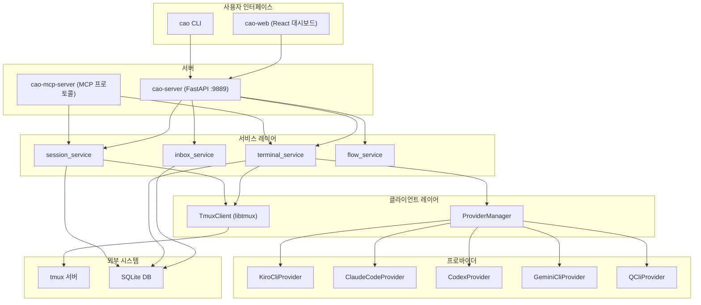
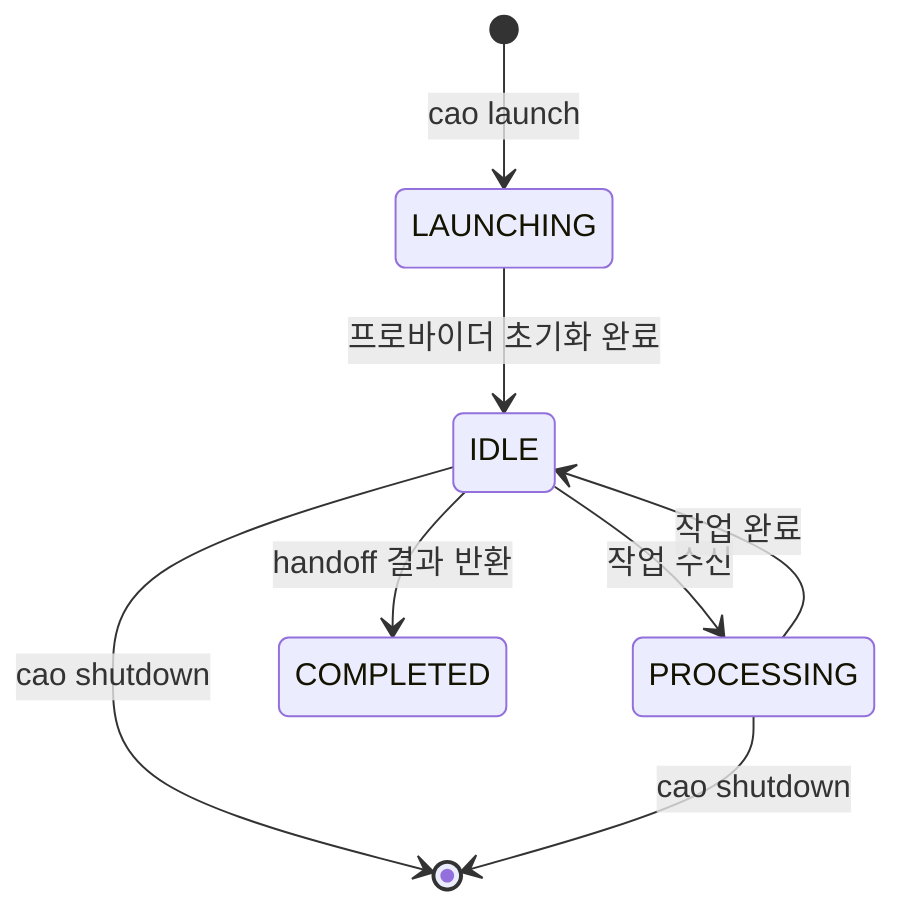
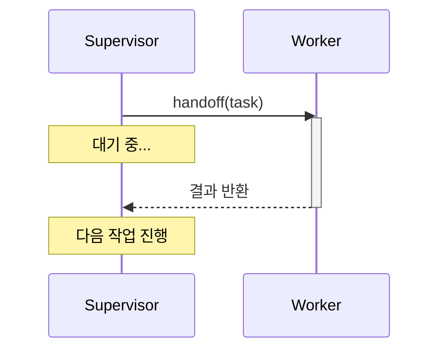
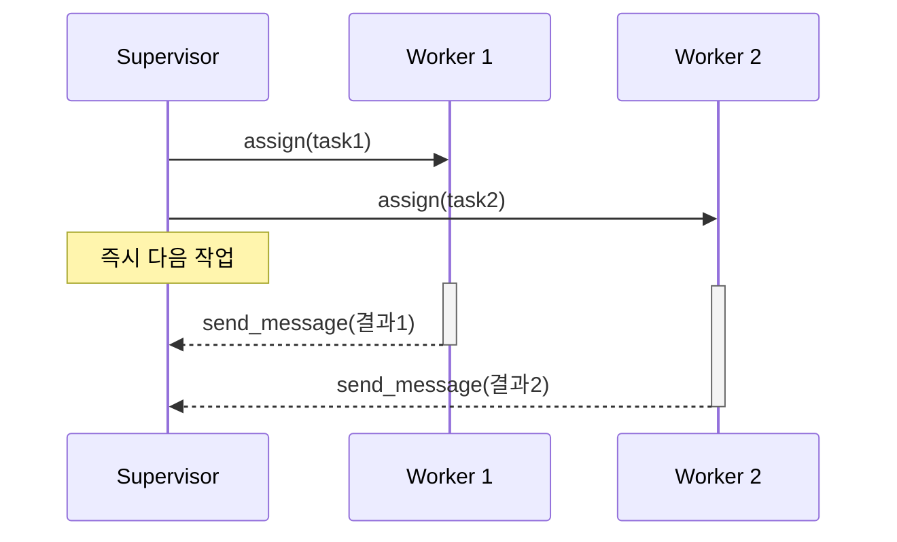
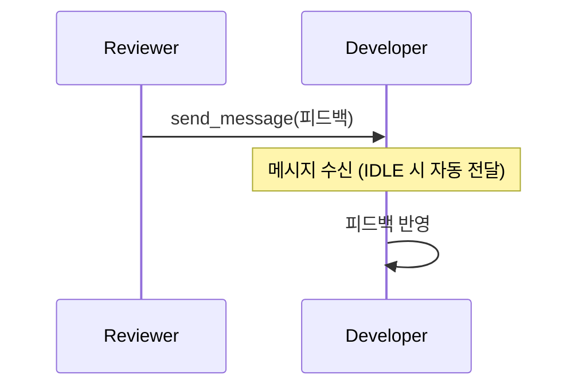
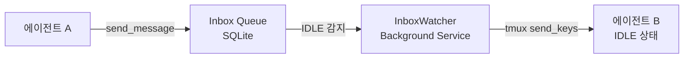
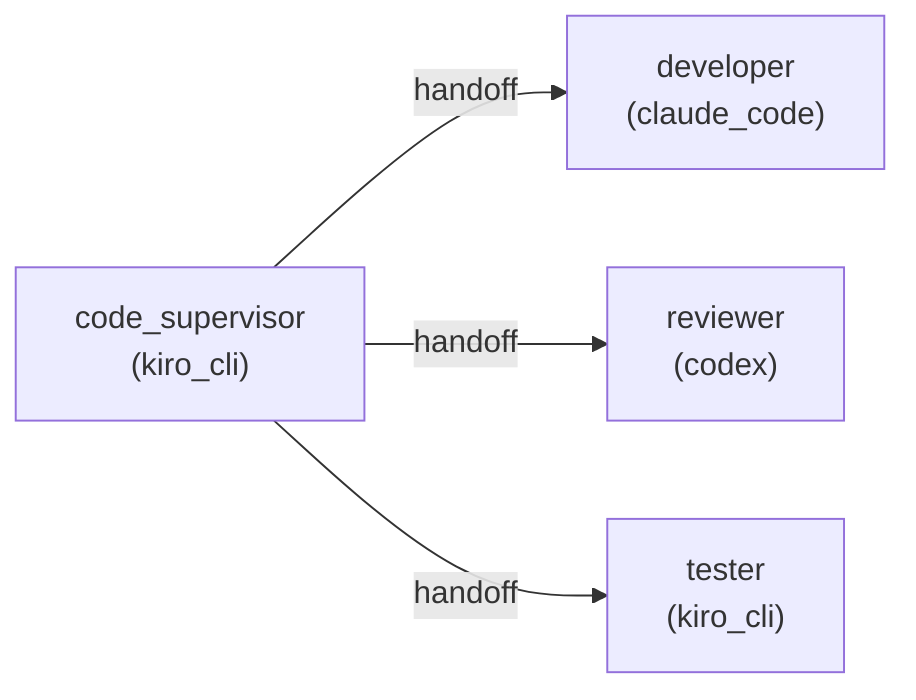

# CAO(CLI Agent Orchestrator) 상세 사용 가이드

이 문서는 CAO의 모든 기능을 상세하게 설명하는 레퍼런스 가이드입니다.

## 목차

- [왜 CAO를 사용하는가?](#왜-cao를-사용하는가)
- [아키텍처 개요](#아키텍처-개요)
- [CLI 명령어 레퍼런스](#cli-명령어-레퍼런스)
- [에이전트 프로필](#에이전트-프로필)
- [오케스트레이션 패턴](#오케스트레이션-패턴)
- [Flow 시스템](#flow-시스템)
- [환경 변수 관리](#환경-변수-관리)
- [tmux 세션 관리](#tmux-세션-관리)
- [크로스 프로바이더 오케스트레이션](#크로스-프로바이더-오케스트레이션)
- [실전 워크플로우 예제](#실전-워크플로우-예제)

---

## 왜 CAO를 사용하는가?

### 단일 에이전트 vs 멀티 에이전트

AI 코딩 에이전트(Kiro CLI, Claude Code 등)를 하나만 사용하는 것과 CAO로 여러 에이전트를 오케스트레이션하는 것의 차이를 비교합니다.

| 항목 | 단일 에이전트 | CAO 멀티 에이전트 |
| --- | --- | --- |
| 컨텍스트 관리 | 한 세션에 모든 맥락이 쌓여 윈도우 포화 | 에이전트별 독립 세션으로 맥락 분리 |
| 역할 수행 | 코드 작성과 리뷰를 같은 에이전트가 수행 → 자기 검증의 맹점 | developer가 짠 코드를 reviewer가 별도 세션에서 객관적으로 리뷰 |
| 처리 속도 | 모든 작업을 순차 처리 | `assign()`으로 독립 작업을 병렬 실행 |
| 품질 보증 | 수동으로 "리뷰해줘" 요청 필요 | supervisor가 자동으로 작성 → 리뷰 → 테스트 사이클 조율 |
| 확장성 | 작업이 복잡해지면 한 에이전트가 감당 불가 | 에이전트 추가로 수평 확장 |

### 스크립트 직접 구현 vs CAO

tmux + bash 스크립트로 멀티 에이전트를 직접 만들 수도 있습니다. 하지만 실제로 필요한 것들을 비교하면:

| 직접 구현 시 필요한 것 | CAO 제공 여부 |
| --- | --- |
| tmux 세션/윈도우 생성·종료 관리 | ✅ TmuxClient가 libtmux로 자동 관리 |
| CLI 도구별 출력 파싱 및 상태 감지 (IDLE/PROCESSING) | ✅ Provider 시스템이 도구별 어댑터 제공 |
| 에이전트 간 메시지 큐 (수신자가 바쁠 때 대기) | ✅ Inbox 시스템 + InboxWatcher가 자동 전달 |
| 동기(handoff) / 비동기(assign) 작업 패턴 | ✅ MCP 도구로 기본 제공 |
| 에이전트 역할 정의 및 시스템 프롬프트 관리 | ✅ Agent Profile (마크다운 + YAML frontmatter) |
| 다양한 프로바이더 혼합 사용 | ✅ 크로스 프로바이더 오케스트레이션 |
| 스케줄 기반 자동 실행 | ✅ Flow 시스템 (cron 스타일) |
| 웹 대시보드로 모니터링 | ✅ cao-web (React UI) |
| REST API | ✅ cao-server (FastAPI) |

직접 구현하면 이 인프라 코드만 수백~수천 줄이 되고, 프로바이더가 업데이트될 때마다 유지보수해야 합니다. CAO는 이 모든 것을 내장하고 있어서, 사용자는 에이전트 프로필(마크다운 파일)만 작성하면 됩니다.

### CAO가 특히 유용한 시나리오

1. **대규모 기능 개발** — 여러 모듈을 동시에 개발하고, 각각에 대해 리뷰와 테스트를 병렬로 진행
2. **코드 품질이 중요한 프로젝트** — 작성자와 리뷰어를 분리하여 자기 검증 맹점 제거
3. **다양한 AI 도구 활용** — 특정 작업에 강한 도구를 골라 쓰기 (예: Claude Code로 복잡한 로직, Kiro CLI로 AWS 인프라)
4. **반복 워크플로우 자동화** — Flow 시스템으로 모니터링, 헬스체크, 정기 리팩토링 등을 스케줄링
5. **CI/CD 파이프라인 통합** — `--headless` 모드로 백그라운드 실행하여 자동화 파이프라인에 편입

CAO는 3개의 실행 파일과 여러 레이어로 구성됩니다.



### 핵심 개념

| 개념 | 설명 |
| --- | --- |
| Session | 하나 이상의 에이전트 터미널을 담는 컨테이너. tmux 세션에 매핑 |
| Terminal | 개별 에이전트 인스턴스. tmux 윈도우에서 실행되며 DB에서 상태 추적 |
| Provider | CLI 도구별 어댑터. 초기화, 상태 감지, 메시지 추출 담당 |
| Agent Profile | 에이전트의 역할/행동을 정의하는 마크다운 파일 |
| Inbox | 터미널 간 메시지 큐. 수신자가 IDLE일 때 자동 전달 |
| Flow | 스케줄 기반 자동 에이전트 실행 |

### 터미널 상태 라이프사이클



---

## CLI 명령어 레퍼런스

### cao launch

에이전트를 실행합니다.

```bash
cao launch --agents <프로필명> [옵션]
```

| 옵션 | 설명 | 기본값 |
| --- | --- | --- |
| `--agents TEXT` | 에이전트 프로필 이름 (필수) | - |
| `--session-name TEXT` | 세션 이름 지정 | 자동 생성 |
| `--headless` | 디태치 모드로 실행 (백그라운드) | false |
| `--provider TEXT` | 프로바이더 지정 | kiro_cli |
| `--allowed-tools TEXT` | 허용 도구 오버라이드 (반복 가능) | 프로필 설정 |
| `--auto-approve` | 확인 프롬프트 건너뛰기 | false |
| `--yolo` | 모든 제한 해제 + 확인 건너뛰기 (위험) | false |

예시:

```bash
# 기본 실행
cao launch --agents code_supervisor

# 프로바이더 지정
cao launch --agents developer --provider claude_code

# 백그라운드 실행
cao launch --agents developer --headless

# 확인 없이 실행
cao launch --agents code_supervisor --auto-approve

# 세션 이름 지정
cao launch --agents code_supervisor --session-name my-project

# 도구 제한 오버라이드
cao launch --agents developer --allowed-tools execute_bash --allowed-tools fs_read
```

### cao shutdown

세션을 종료합니다.

```bash
# 모든 세션 종료
cao shutdown --all

# 특정 세션 종료
cao shutdown --session cao-abc12345
```

### cao install

에이전트 프로필을 설치합니다.

```bash
cao install <소스> [옵션]
```

소스 유형:
- 이름: `cao install developer` (빌트인 스토어에서)
- 파일: `cao install ./my-agent.md`
- URL: `cao install https://example.com/agent.md`

| 옵션 | 설명 |
| --- | --- |
| `--provider TEXT` | 프로바이더 지정 (q_cli, kiro_cli, claude_code, codex, kimi_cli, gemini_cli, copilot_cli) |
| `--env TEXT` | 환경 변수 설정 (반복 가능, KEY=VALUE 형식) |

예시:

```bash
# 빌트인 프로필 설치
cao install code_supervisor
cao install developer
cao install reviewer

# 커스텀 프로필 설치
cao install ./profiles/tester.md

# 환경 변수와 함께 설치
cao install ./service-agent.md --env API_TOKEN=my-secret --env SERVICE_URL=http://localhost:8080
```

### cao init

CAO 데이터베이스를 초기화합니다.

```bash
cao init
```

### cao info

현재 세션 정보를 표시합니다.

```bash
cao info
```

### cao-server

CAO HTTP API 서버를 시작합니다 (포트 9889).

```bash
# 포그라운드 실행
cao-server

# 백그라운드 실행
cao-server &

# 로그 파일로 출력
cao-server &> /tmp/cao-server.log &
```

### cao mcp-server

MCP 프로토콜 서버를 시작합니다. 에이전트가 오케스트레이션 도구(handoff, assign, send_message)에 접근할 때 사용합니다.

```bash
cao mcp-server
```

> 일반적으로 직접 실행하지 않습니다. 에이전트 프로필의 `mcpServers` 설정에서 자동으로 시작됩니다.

---

## 에이전트 프로필

### 파일 형식

에이전트 프로필은 YAML frontmatter가 있는 마크다운 파일입니다.

```markdown
---
name: my-agent
description: "에이전트 설명"
role: developer
provider: kiro_cli
mcpServers:
  cao-mcp-server:
    type: stdio
    command: cao
    args: ["mcp-server"]
allowedTools:
  - "@cao-mcp-server"
  - fs_read
  - fs_list
---

# 에이전트 시스템 프롬프트

이 마크다운 본문이 에이전트의 시스템 프롬프트가 됩니다.
에이전트의 역할, 행동 규칙, 작업 지침을 여기에 작성합니다.
```

### Frontmatter 필드

| 필드 | 타입 | 필수 | 설명 |
| --- | --- | --- | --- |
| `name` | string | ✅ | 에이전트 고유 식별자 |
| `description` | string | ✅ | 에이전트 설명 |
| `role` | string | | 역할 프리셋 (supervisor, developer, reviewer) |
| `provider` | string | | 프로바이더 오버라이드 |
| `mcpServers` | object | | MCP 서버 설정 |
| `allowedTools` | list | | 허용 도구 목록 |
| `tools` | list | | 도구 목록 (`["*"]`로 전체 허용) |
| `model` | string | | AI 모델 지정 |
| `hooks` | object | | 라이프사이클 훅 |

### role 프리셋

| role | 설명 | 기본 허용 도구 |
| --- | --- | --- |
| `supervisor` | 워크플로우 조율자 | @cao-mcp-server, fs_read, fs_list |
| `developer` | 코드 작성자 | 프로바이더 기본 도구 |
| `reviewer` | 코드 리뷰어 | 프로바이더 기본 도구 |

### 프로필 저장 경로

CAO는 다음 순서로 프로필을 검색합니다:

1. `~/.aws/cli-agent-orchestrator/agent-store/` (로컬 스토어)
2. `~/.aws/cli-agent-orchestrator/agent-context/` (에이전트 컨텍스트)
3. 프로바이더별 디렉토리
4. 사용자 추가 디렉토리 (설정에서 지정)
5. 빌트인 스토어 (CAO 패키지 내장)

### 프로필 예시: 4에이전트 하네스

```bash
# supervisor - 워크플로우 조율
cao install ./profiles/code_supervisor.md

# developer - 코드 구현
cao install ./profiles/developer.md

# reviewer - 코드 리뷰
cao install ./profiles/reviewer.md

# tester - 테스트 실행
cao install ./profiles/tester.md
```

---

## 오케스트레이션 패턴

CAO는 3가지 오케스트레이션 패턴을 제공합니다. 에이전트가 MCP 도구를 통해 사용합니다.

### Handoff (동기식)

작업을 전달하고 완료를 기다립니다.



사용 시나리오:
- 이전 작업의 결과가 다음 작업의 입력으로 필요할 때
- 순차적 워크플로우 (코드 작성 → 리뷰 → 테스트)
- 테스트 결과를 기다려야 할 때

### Assign (비동기식)

작업을 할당하고 즉시 다음으로 진행합니다.



사용 시나리오:
- 독립적인 작업을 병렬로 처리할 때
- developer와 reviewer에게 동시에 작업 할당
- 여러 모듈을 동시에 개발할 때

### Send Message (직접 통신)

에이전트 간 직접 메시지를 전송합니다.



사용 시나리오:
- 코드 리뷰 피드백 전달
- 진행 상황 공유
- supervisor를 거치지 않는 직접 통신

### Inbox 시스템

`send_message()`로 보낸 메시지는 Inbox에 큐잉됩니다. 수신 에이전트가 IDLE 상태가 되면 자동으로 전달됩니다.



---

## Flow 시스템

Flow는 스케줄 기반으로 에이전트를 자동 실행하는 시스템입니다.

### Flow 관리 명령어

```bash
# Flow 목록 확인
cao flow list

# Flow 추가 (YAML 파일에서)
cao flow add flow-config.yaml

# Flow 수동 실행
cao flow run <flow-name>

# Flow 활성화/비활성화
cao flow enable <flow-name>
cao flow disable <flow-name>

# Flow 삭제
cao flow remove <flow-name>
```

### Flow 설정 파일 예시

```yaml
name: health-check
schedule: "*/5 * * * *"  # 5분마다
agent_profile: monitor
provider: kiro_cli
prompt: "서비스 상태를 확인하고 이상이 있으면 보고하세요"
condition_script: ./check-service.sh  # 조건부 실행 (선택)
```

### 조건부 Flow

`condition_script`를 지정하면 스크립트의 exit code에 따라 실행 여부를 결정합니다:
- exit 0: Flow 실행
- exit 1: Flow 건너뛰기

```bash
#!/bin/bash
# check-service.sh
curl -sf http://localhost:8080/health > /dev/null
# 서비스가 응답하지 않으면 exit 1 → 에이전트가 개입
if [ $? -ne 0 ]; then
    exit 0  # 에이전트 실행
else
    exit 1  # 정상이므로 건너뛰기
fi
```

---

## 환경 변수 관리

CAO는 에이전트 프로필에서 `${VAR}` 플레이스홀더를 지원합니다.

### 환경 변수 명령어

```bash
# 변수 설정
cao env set API_TOKEN my-secret-token
cao env set SERVICE_URL http://localhost:8080

# 변수 조회
cao env get API_TOKEN

# 전체 목록
cao env list

# 변수 삭제
cao env unset API_TOKEN
```

### 프로필에서 환경 변수 사용

```markdown
---
name: service-agent
description: "서비스 모니터링 에이전트"
mcpServers:
  my-service:
    type: stdio
    command: curl
    args: ["-H", "Authorization: Bearer ${API_TOKEN}", "${SERVICE_URL}/api"]
---
```

환경 변수는 `~/.aws/cli-agent-orchestrator/.env`에 저장됩니다.

---

## tmux 세션 관리

CAO는 각 에이전트를 tmux 세션의 윈도우에서 실행합니다.

### 세션 확인

```bash
# CAO 세션 목록
tmux list-sessions

# 출력 예시:
# cao-abc12345: 2 windows (created Tue Apr 22 10:30:00 2026)
```

### 세션 접속/분리

```bash
# 세션에 접속
tmux attach -t cao-abc12345

# 세션에서 분리 (세션 유지)
# Ctrl+B → D
```

### 윈도우 전환 (세션 내부)

```text
Ctrl+B → n    : 다음 윈도우
Ctrl+B → p    : 이전 윈도우
Ctrl+B → 0~9  : 번호로 윈도우 이동
Ctrl+B → w    : 윈도우 목록 (인터랙티브 선택)
```

### 세션 간 전환

```text
Ctrl+B → S    : 세션 목록 표시
Ctrl+B → (    : 이전 세션
Ctrl+B → )    : 다음 세션
```

### 스크롤/복사 모드

```text
Ctrl+B → [    : 복사 모드 진입 (스크롤 가능)
q             : 복사 모드 종료
↑/↓           : 스크롤
/             : 검색
```

### CAO 세션 정리

```bash
# CAO를 통한 정리 (권장)
cao shutdown --all

# tmux 직접 정리
tmux kill-server  # 모든 세션 종료
```

---

## 크로스 프로바이더 오케스트레이션

CAO는 서로 다른 프로바이더의 에이전트를 하나의 워크플로우에서 조합할 수 있습니다.

### 지원 프로바이더

| 프로바이더 | 값 | CLI 도구 |
| --- | --- | --- |
| Kiro CLI | `kiro_cli` | kiro-cli (기본값) |
| Claude Code | `claude_code` | claude |
| Codex | `codex` | codex |
| Amazon Q | `q_cli` | q |
| Gemini CLI | `gemini_cli` | gemini |
| Kimi CLI | `kimi_cli` | kimi |
| Copilot CLI | `copilot_cli` | copilot |

### 프로필에서 프로바이더 지정

에이전트 프로필의 frontmatter에 `provider` 필드를 추가하면, supervisor의 프로바이더와 관계없이 해당 프로바이더로 실행됩니다.

```markdown
---
name: developer
description: "Claude Code 기반 개발자"
provider: claude_code
role: developer
---
```

### 크로스 프로바이더 워크플로우 예시

```bash
# supervisor는 Kiro CLI로 실행
cao launch --agents code_supervisor --provider kiro_cli

# developer 프로필에 provider: claude_code가 설정되어 있으면
# supervisor가 handoff/assign 시 자동으로 Claude Code로 실행됨
```



---

## 실전 워크플로우 예제

### 예제 1: 4에이전트 하네스 (기본)

```bash
# 1. 서버 시작
cao-server &

# 2. supervisor 실행
cao launch --agents code_supervisor --auto-approve

# supervisor가 자동으로 다른 에이전트를 assign/handoff로 실행
# 사용자는 tmux 세션에서 모니터링
```

### 예제 2: 수동 멀티 에이전트

```bash
# 1. 서버 시작
cao-server &

# 2. 에이전트 개별 실행
cao launch --agents code_supervisor --auto-approve
cao launch --agents developer --auto-approve --headless
cao launch --agents reviewer --auto-approve --headless
cao launch --agents tester --auto-approve --headless

# 3. supervisor 세션에서 작업 지시
tmux attach -t <supervisor-session>
```

### 예제 3: 헤드리스 CI/CD 파이프라인

```bash
# 서버 시작
cao-server &

# 헤드리스로 에이전트 실행 (백그라운드)
cao launch --agents code_supervisor --headless --auto-approve

# 완료 대기 후 결과 확인
# (Flow 시스템 또는 외부 스크립트로 모니터링)
```

### 예제 4: Flow를 이용한 자동 모니터링

```bash
# 모니터링 Flow 등록
cao flow add monitor-flow.yaml

# Flow 목록 확인
cao flow list

# 수동 테스트 실행
cao flow run health-check
```

---

## 주요 디렉토리 구조

```text
~/.aws/cli-agent-orchestrator/
├── agent-store/          # 설치된 에이전트 프로필 (로컬)
├── agent-context/        # 에이전트 컨텍스트 파일
├── logs/
│   └── terminal/         # 터미널별 로그 (pipe-pane 출력)
├── db/                   # SQLite 데이터베이스
├── flows/                # Flow 설정 파일
└── .env                  # 환경 변수
```

---

## 팁과 베스트 프랙티스

1. supervisor는 항상 먼저 실행하세요. 다른 에이전트는 supervisor가 필요에 따라 assign/handoff로 생성합니다.

2. `--auto-approve`를 사용하면 매번 확인 프롬프트를 건너뛸 수 있습니다. 하지만 `--yolo`는 모든 도구 제한을 해제하므로 주의하세요.

3. 에이전트 프로필의 `allowedTools`로 도구 접근을 제한하세요. `@cao-mcp-server`는 오케스트레이션 도구(handoff, assign, send_message)에 대한 접근을 의미합니다.

4. `--headless` 모드로 실행하면 tmux 세션에 자동 접속하지 않습니다. 여러 에이전트를 한꺼번에 띄울 때 유용합니다.

5. 로그는 `~/.aws/cli-agent-orchestrator/logs/terminal/`에 저장됩니다. 문제 발생 시 여기서 확인하세요.

6. 세션 이름을 `--session-name`으로 지정하면 프로젝트별로 세션을 구분할 수 있습니다.
