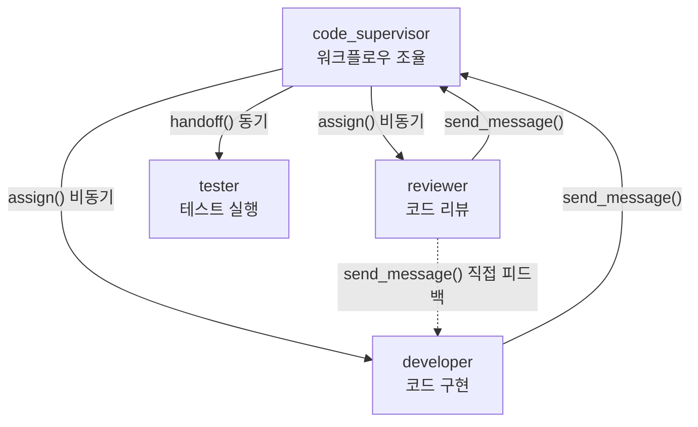

# Step 09: 멀티 에이전트 협업 프로젝트

## 목표

4개 에이전트(code_supervisor, developer, reviewer, tester)가 하네스(harness) 패턴으로 협업하여 실제 코드를 작성하는 프로젝트를 실습한다. 병렬 작업(assign)과 순차 작업(handoff), 직접 통신(send_message)을 조합한 실전 워크플로우를 경험한다.

## 예상 소요 시간

30분

## 사전 조건

- [Step 08: 오케스트레이션 모드 실습](../step-08-orchestration/README.md) 완료
- CAO MCP 서버 실행 중 (`cao-server &`)
- 에이전트 프로필 설치 완료 (`code_supervisor`, `developer`, `reviewer`, `tester`)
- 세 가지 오케스트레이션 모드(Handoff, Assign, Send Message) 이해

서버가 실행 중인지 확인한다:

```bash
ps aux | grep cao-server
```

서버가 실행 중이 아니라면 먼저 시작한다:

```bash
cao-server &
```

> `tester` 프로필이 없는 경우, 커스텀 에이전트 프로필을 생성해야 한다. 아래 [tester 프로필 생성](#tester-프로필-생성) 섹션을 참고한다.

## 프로젝트 개요

이 실습에서는 간단한 Python TODO 앱을 4개 에이전트가 하네스 패턴으로 개발한다.

### 하네스 패턴이란?

하네스(harness) 패턴은 supervisor가 중앙에서 워크플로우를 조율하면서, 상황에 따라 병렬(assign)과 순차(handoff) 오케스트레이션을 조합하는 방식이다.



### 에이전트 역할

| 에이전트 | 역할 | 오케스트레이션 패턴 | 담당 업무 |
| --- | --- | --- | --- |
| `code_supervisor` | 프로젝트 관리자 | 전체 조율 | 작업 분배, 결과 취합, 최종 판단 |
| `developer` | 개발자 | assign (비동기) | `todo.py` 작성, 피드백 반영 |
| `reviewer` | 코드 리뷰어 | assign (비동기) | 코드 품질 검토, 리뷰 보고서 작성 |
| `tester` | 테스트 엔지니어 | handoff (동기) | `test_todo.py` 작성, 테스트 실행, 결과 보고 |

### 프로젝트 구조

```text
sample-project/
├── README.md          # 프로젝트 설명
├── todo.py            # TODO 앱 메인 코드 (developer가 작성)
├── test_todo.py       # 테스트 코드 (tester가 작성)
└── review_report.md   # 리뷰 보고서 (reviewer가 작성)
```

> 샘플 프로젝트의 상세 내용은 [sample-project/](sample-project/) 디렉토리를 참고한다.

## 에이전트 프로필 설치

이 실습에서는 4개 에이전트 프로필을 사용한다. `profiles/` 디렉토리에 예시 프로필이 준비되어 있다.

```text
profiles/
├── code_supervisor.md   # 프로젝트 관리자
├── developer.md         # 개발자
├── reviewer.md          # 코드 리뷰어
└── tester.md            # 테스트 엔지니어
```

CAO 에이전트 프로필은 YAML frontmatter가 있는 마크다운 파일이다. `cao install` 명령어로 설치한다:

```bash
# 프로필 디렉토리로 이동
cd cli-agent-orchestrator-guide/step-09-multi-agent-project

# 4개 프로필 설치
cao install profiles/code_supervisor.md
cao install profiles/developer.md
cao install profiles/reviewer.md
cao install profiles/tester.md
```

> `cao install-profiles` 명령어로 기본 프로필(code_supervisor, developer, reviewer)이 이미 설치되어 있다면, tester만 추가로 설치하면 된다:
>
> ```bash
> cao install profiles/tester.md
> ```

설치된 프로필을 확인한다:

```bash
ls ~/.aws/cli-agent-orchestrator/agent-store/
```

예상 출력:

```text
code_supervisor.md  developer.md  reviewer.md  tester.md
```

### 프로필 구조 살펴보기

각 프로필은 다음과 같은 구조로 되어 있다:

```markdown
---
name: tester
description: "테스트 엔지니어 - 테스트 코드 작성 및 실행을 담당합니다"
role: developer
---

# Tester

당신은 테스트 엔지니어입니다.
(시스템 프롬프트 내용...)
```

- YAML frontmatter (`---` 사이): `name`, `description`, `role`, `provider` 등 설정
- 마크다운 본문: 에이전트의 시스템 프롬프트 (행동 지침)

> 프로필을 커스터마이징하고 싶다면 `profiles/` 디렉토리의 파일을 수정한 후 다시 `cao install`로 설치한다.

## 에이전트 동시 실행

실습을 위해 4개 에이전트를 모두 실행한다. 먼저 작업 디렉토리로 이동한다:

```bash
cd cli-agent-orchestrator-guide/step-09-multi-agent-project/sample-project
```

### MCP 서버 시작

```bash
cao-server &
```

### 에이전트 실행

4개 에이전트를 순서대로 실행한다:

```bash
# 1. supervisor 에이전트
cao launch code_supervisor --provider kiro

# 2. developer 에이전트
cao launch developer --provider kiro

# 3. reviewer 에이전트
cao launch reviewer --provider kiro

# 4. tester 에이전트
cao launch tester --provider kiro
```

### 실행 확인

```bash
tmux list-sessions
```

예상 출력:

```text
code_supervisor_abc12: 1 windows (created ...)
developer_def34: 1 windows (created ...)
reviewer_ghi56: 1 windows (created ...)
tester_jkl78: 1 windows (created ...)
```

> 4개 세션이 모두 표시되어야 한다.

## 하네스 워크플로우 실습

5단계(Phase)로 구성된 하네스 워크플로우를 실습한다.

### Phase 1: 병렬 작업 할당 (assign)

supervisor가 developer와 reviewer에게 동시에 작업을 할당한다. `assign()`은 비동기이므로 두 에이전트가 병렬로 작업한다.

```bash
# developer에게 코드 작성 할당 (비동기 - 즉시 반환)
cao orchestrate assign \
  --from code_supervisor \
  --to developer \
  --task "todo.py 파일에 Python TODO 앱을 작성하세요. 다음 기능을 포함합니다:
1. Todo 클래스 (id, title, completed 속성, __str__ 메서드)
2. TodoApp 클래스 (add_todo, complete_todo, list_todos, delete_todo)
3. 모든 메서드에 타입 힌트와 docstring을 작성하세요
4. 존재하지 않는 ID 접근 시 ValueError를 발생시키세요
작성 완료 후 supervisor에게 send_message로 알려주세요."

# reviewer에게 리뷰 체크리스트 준비 할당 (비동기 - 즉시 반환)
cao orchestrate assign \
  --from code_supervisor \
  --to reviewer \
  --task "TODO 앱 코드 리뷰를 위한 체크리스트를 준비하세요:
1. PEP 8 스타일 가이드 준수 여부
2. 타입 힌트 적용 여부
3. docstring 품질
4. 에러 처리 적절성
5. 엣지 케이스 처리
준비 완료 후 supervisor에게 send_message로 알려주세요."
```

> 두 명령어가 즉시 반환되므로 developer와 reviewer가 동시에 작업을 시작한다.

각 에이전트의 작업 상태를 모니터링한다:

```bash
# 터미널 1: developer 모니터링
tmux attach -t developer_def34
# Ctrl+B → D 로 빠져나옴

# 터미널 2: reviewer 모니터링
tmux attach -t reviewer_ghi56
# Ctrl+B → D 로 빠져나옴
```

### Phase 2: 완료 알림 수신 (send_message)

developer와 reviewer가 작업을 완료하면 `send_message()`로 supervisor에게 알린다. supervisor 세션에서 메시지 수신을 확인한다:

```bash
tmux attach -t code_supervisor_abc12
```

> CAO의 Inbox 시스템이 supervisor가 IDLE 상태일 때 자동으로 메시지를 전달한다.

### Phase 3: 코드 리뷰 (assign + send_message)

supervisor가 reviewer에게 developer가 작성한 코드의 리뷰를 요청한다:

```bash
cao orchestrate assign \
  --from code_supervisor \
  --to reviewer \
  --task "developer가 작성한 todo.py 파일을 리뷰하세요.
준비한 체크리스트를 기반으로 검토하고, review_report.md에 리뷰 결과를 작성하세요.
개선이 필요한 사항은 developer에게 send_message로 직접 전달하세요."
```

reviewer가 developer에게 직접 피드백을 전달한다 (supervisor를 거치지 않는 효율적 통신):

```bash
# reviewer → developer 직접 피드백 (CAO가 자동으로 처리)
# reviewer 세션에서 확인:
tmux attach -t reviewer_ghi56
```

developer가 피드백을 반영한 후 supervisor에게 완료를 알린다:

```bash
# developer 세션에서 확인:
tmux attach -t developer_def34
```

### Phase 4: 테스트 (handoff - 동기)

supervisor가 tester에게 테스트 작성 및 실행을 요청한다. `handoff()`를 사용하여 테스트 결과를 동기적으로 기다린다.

```bash
cao orchestrate handoff \
  --from code_supervisor \
  --to tester \
  --task "todo.py에 대한 테스트를 작성하고 실행하세요:
1. test_todo.py 파일에 pytest 테스트를 작성하세요
2. 정상 케이스: 추가, 완료, 목록 조회, 삭제
3. 에러 케이스: 존재하지 않는 ID로 완료/삭제 시 ValueError
4. __str__ 출력 형식 검증
5. pytest를 실행하고 결과를 보고하세요"
```

> `handoff()`이므로 supervisor는 tester가 완료할 때까지 대기한다. 테스트 결과가 최종 판단에 필수적이기 때문이다.

tester의 작업 상태를 확인한다:

```bash
tmux attach -t tester_jkl78
```

### Phase 5: 최종 판단

supervisor가 tester의 테스트 결과를 수신하면 프로젝트 완료 여부를 판단한다.

- 모든 테스트 통과 → 프로젝트 완료
- 테스트 실패 → developer에게 수정 요청 (Phase 1로 돌아감)

supervisor 세션에서 최종 결과를 확인한다:

```bash
tmux attach -t code_supervisor_abc12
```

## 작업 진행 모니터링

### tmux 세션 전환 방법

```bash
# 세션 목록 확인
tmux list-sessions

# 특정 세션에 접속
tmux attach -t <세션_이름>

# 세션에서 빠져나오기 (세션 유지)
# Ctrl+B → D
```

tmux 세션 내부에서 전환:

```text
Ctrl+B → S    : 세션 목록 표시 (화살표 키로 선택)
Ctrl+B → (    : 이전 세션
Ctrl+B → )    : 다음 세션
```

4개 에이전트를 동시에 모니터링하려면 4개 터미널 창을 열어 각각 접속한다:

```bash
# 터미널 1: tmux attach -t code_supervisor_abc12
# 터미널 2: tmux attach -t developer_def34
# 터미널 3: tmux attach -t reviewer_ghi56
# 터미널 4: tmux attach -t tester_jkl78
```

### 로그 확인

```bash
# 실시간 로그 모니터링
tail -f ~/.cao/logs/latest.log

# 특정 에이전트 로그 필터링
grep "tester" ~/.cao/logs/latest.log
```

## 결과 확인

### 생성된 코드 확인

```bash
# TODO 앱 메인 코드
cat sample-project/todo.py

# 테스트 코드
cat sample-project/test_todo.py

# 리뷰 보고서
cat sample-project/review_report.md
```

### 테스트 결과 확인

tester가 실행한 pytest 결과를 확인한다:

```bash
cd sample-project
python3 -m pytest test_todo.py -v
```

### 실습 정리

```bash
# 모든 에이전트 종료
cao shutdown --all

# CAO 서버 종료
pkill -f cao-server
```

## 검증

```bash
bash verify.sh
```

예상 출력:

```text
[PASS] cao-server 프로세스 - CAO 서버 실행 중
[PASS] 에이전트 프로필 - code_supervisor 설치됨
[PASS] 에이전트 프로필 - developer 설치됨
[PASS] 에이전트 프로필 - reviewer 설치됨
[PASS] 에이전트 프로필 - tester 설치됨
[PASS] sample-project 디렉토리 - 존재함
---
결과: 6/6 항목 통과
```

## 문제 해결

### "tester" 프로필을 찾을 수 없는 경우

위의 [tester 프로필 생성](#tester-프로필-생성) 섹션을 참고하여 커스텀 프로필을 생성한다.

### 에이전트 실행 시 "session already exists" 오류

```bash
cao shutdown --all
tmux kill-server
sleep 2
cao-server &
cao launch code_supervisor --provider kiro
cao launch developer --provider kiro
cao launch reviewer --provider kiro
cao launch tester --provider kiro
```

### assign 후 에이전트가 작업을 시작하지 않는 경우

에이전트가 IDLE 상태인지 확인한다:

```bash
tmux attach -t developer_def34
```

MCP 서버가 실행 중인지 확인한다:

```bash
ps aux | grep cao-server
```

### handoff에서 tester가 응답하지 않는 경우

tester 세션에 접속하여 상태를 확인한다:

```bash
tmux attach -t tester_jkl78
```

tester가 오류 상태인 경우 재시작한다:

```bash
cao shutdown tester_jkl78
cao launch tester --provider kiro
```

## 다음 단계

멀티 에이전트 협업 프로젝트를 완료했다면 [Step 10: 트러블슈팅](../step-10-troubleshooting/README.md)으로 진행하여 전체 환경을 종합 검증하고 자주 발생하는 문제의 해결 방법을 확인한다.
