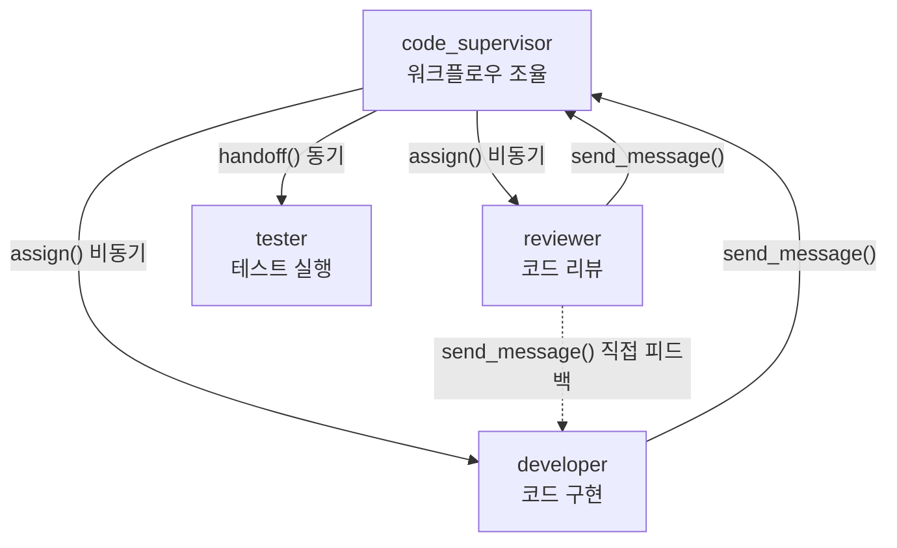
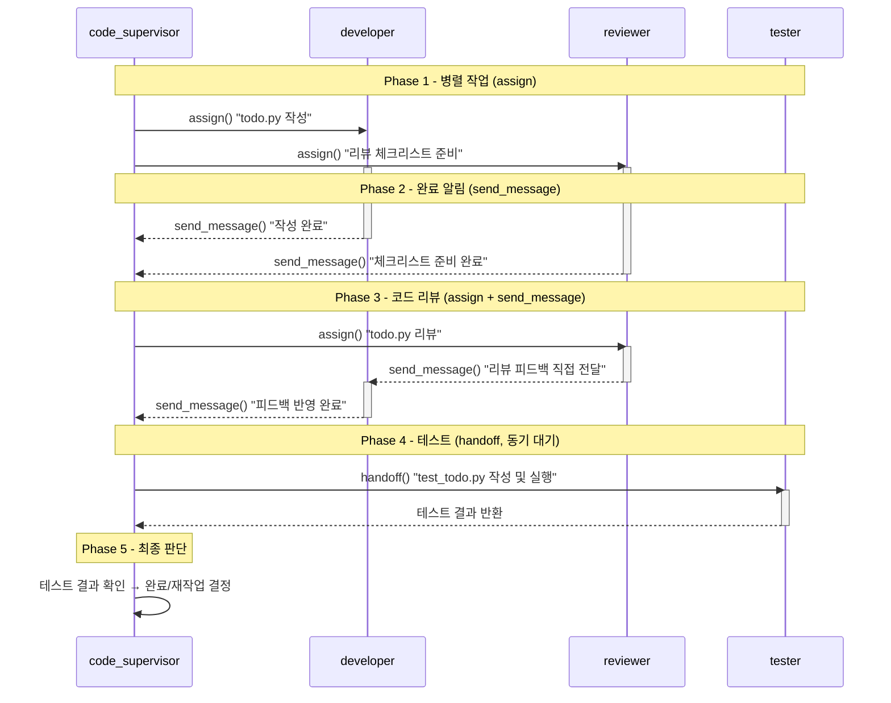

# Python TODO 앱 - 4에이전트 하네스 협업 프로젝트

## 프로젝트 설명

이 프로젝트는 CLI Agent Orchestrator(CAO)의 멀티 에이전트 협업을 실습하기 위한 간단한 TODO 관리 앱이다. 4개 에이전트(`code_supervisor`, `developer`, `reviewer`, `tester`)가 하네스(harness) 패턴으로 협업하여 하나의 프로젝트를 완성한다.

하네스 패턴이란 supervisor가 중앙에서 작업을 조율하면서, 병렬(assign)과 순차(handoff) 오케스트레이션을 조합하여 효율적으로 워크플로우를 진행하는 방식이다.

## 아키텍처



## 프로젝트 구조

```text
sample-project/
├── README.md          # 프로젝트 설명 (현재 파일)
├── todo.py            # TODO 앱 메인 코드 (developer가 작성)
├── test_todo.py       # 테스트 코드 (tester가 작성)
└── review_report.md   # 리뷰 보고서 (reviewer가 작성)
```

- `todo.py`: TODO 앱의 핵심 로직. developer 에이전트가 작성한다.
- `test_todo.py`: `todo.py`의 기능을 검증하는 테스트. tester 에이전트가 작성하고 실행한다.
- `review_report.md`: 코드 리뷰 결과 보고서. reviewer 에이전트가 작성한다.

> 위 파일들은 실습 과정에서 에이전트가 직접 생성한다. 초기 상태에서는 이 README.md만 존재한다.

## 요구사항

### Todo 클래스

| 속성 | 타입 | 설명 |
| --- | --- | --- |
| `id` | `int` | 할 일 고유 식별자 |
| `title` | `str` | 할 일 제목 |
| `completed` | `bool` | 완료 여부 (기본값: `False`) |

추가 요구사항:

- `__str__` 메서드를 구현하여 `[✓] 1: 제목` 또는 `[✗] 1: 제목` 형식으로 출력한다
- 모든 속성에 타입 힌트를 적용한다

### TodoApp 클래스

| 메서드 | 시그니처 | 설명 |
| --- | --- | --- |
| `add_todo` | `(title: str) -> Todo` | 새로운 할 일을 추가하고 생성된 Todo 객체를 반환한다 |
| `complete_todo` | `(todo_id: int) -> Todo` | 지정한 ID의 할 일을 완료 처리하고 해당 Todo 객체를 반환한다 |
| `list_todos` | `() -> list[Todo]` | 모든 할 일 목록을 반환한다 |
| `delete_todo` | `(todo_id: int) -> None` | 지정한 ID의 할 일을 삭제한다 |

추가 요구사항:

- 모든 메서드에 타입 힌트와 docstring을 적용한다
- 존재하지 않는 ID로 `complete_todo` 또는 `delete_todo`를 호출하면 `ValueError`를 발생시킨다
- ID는 자동 증가 방식으로 관리한다

### 테스트 코드 (test_todo.py)

`pytest`를 사용하여 다음 항목을 테스트한다:

- 할 일 추가 후 목록에 포함되는지 확인
- 할 일 완료 처리 후 `completed` 상태가 `True`인지 확인
- 할 일 삭제 후 목록에서 제거되는지 확인
- 존재하지 않는 ID로 완료/삭제 시 `ValueError`가 발생하는지 확인
- `__str__` 출력 형식이 올바른지 확인

## 에이전트 역할 및 하네스 워크플로우

### 에이전트 역할

| 에이전트 | 역할 | 수행 작업 |
| --- | --- | --- |
| `code_supervisor` | 프로젝트 관리자 | 작업 분배, 워크플로우 조율, 최종 판단 |
| `developer` | 개발자 | `todo.py` 작성, reviewer 피드백 반영 |
| `reviewer` | 코드 리뷰어 | 코드 품질 검토, `review_report.md` 작성 |
| `tester` | 테스트 엔지니어 | `test_todo.py` 작성, 테스트 실행, 결과 보고 |

### 하네스 워크플로우



### 왜 이 패턴인가?

- Phase 1에서 `assign()`을 사용하여 developer와 reviewer가 **병렬로** 작업한다 (시간 절약)
- Phase 4에서 `handoff()`를 사용하여 tester의 결과를 **동기적으로** 기다린다 (테스트 결과가 최종 판단에 필수)
- `send_message()`로 에이전트 간 **직접 피드백**을 주고받는다 (supervisor를 거치지 않는 효율적 통신)

상세한 실습 절차는 상위 디렉토리의 [README.md](../README.md)를 참고한다.
